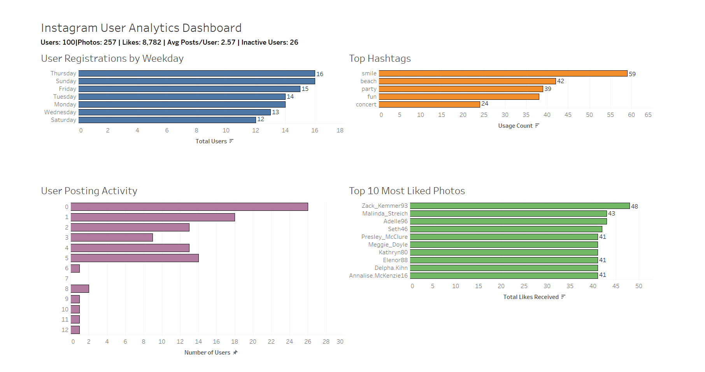

# Instagram User Analytics using SQL & Tableau
## Dashboard Preview


## Project Overview

This project analyzes user engagement and activity on Instagram using SQL and Tableau. The objective was to generate actionable insights for marketing, product, and investor stakeholders by examining user behavior, content engagement, hashtag usage, and potential bot activity.

## Tools Used

* MySQL Workbench
* SQL
* Tableau
* GitHub

## Dataset Overview

The dataset simulates an Instagram-like platform and contains information on:

* Users
* Photos
* Likes
* Hashtags
* Photo Tags

### Dataset Statistics

| Metric                 | Value |
| ---------------------- | ----- |
| Users                  | 100   |
| Photos                 | 257   |
| Likes                  | 8,782 |
| Average Posts per User | 2.57  |
| Inactive Users         | 26    |

---

## Business Questions

### Marketing Analysis

1. Who are the oldest users on the platform?
2. Which users have never posted a photo?
3. Who won the photo contest based on likes?
4. What are the most popular hashtags?
5. Which day records the highest user registrations?

### Investor Metrics

6. What is the average number of posts per user?
7. Which users display bot-like behaviour by liking every photo?

---

## Dashboard


---

## Key Findings

* Thursday and Sunday recorded the highest user registrations with 16 users each
* 26 users have never posted content on the platform
* Zack_Kemmer93 owned the most liked photo with 48 likes
* The most popular hashtag was "smile" with 59 usages
* Average posts per user was 2.57
* 13 users liked every photo on the platform, indicating potential bot behaviour

---

## Recommendations

* Reward loyal early adopters through exclusive campaigns
* Re-engage inactive users with onboarding and promotional initiatives
* Leverage top-performing hashtags in marketing campaigns
* Monitor suspicious engagement patterns to identify automated accounts
* Encourage content creation among low-activity users

---

## Repository Structure

```text
Instagram-User-Analytics
│
├── README.md
├── Instagram_User_Analytics_Report.pdf
├── Instagram_User_Analytics.twbx
├── dashboard.png
│
└── SQL
    ├── A1_Loyal_Users.sql
    ├── A2_Inactive_Users.sql
    ├── A3_Contest_Winner.sql
    ├── A4_Hashtag_Analysis.sql
    ├── A5_Registration_Trends.sql
    ├── A6_User_Engagement.sql
    └── A7_Bot_Detection.sql
```

## Author

Shubhada Patil
MSc Business Analytics
